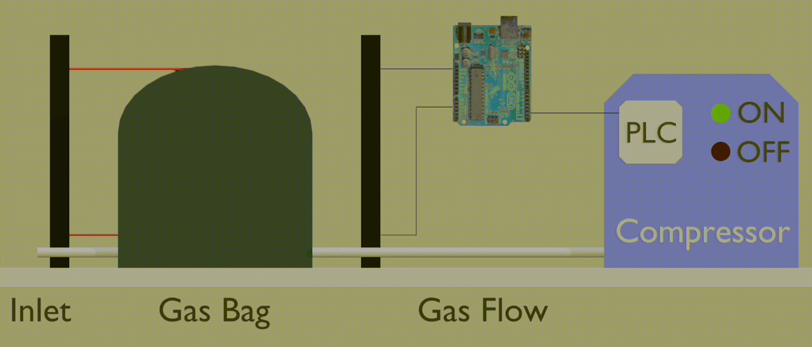
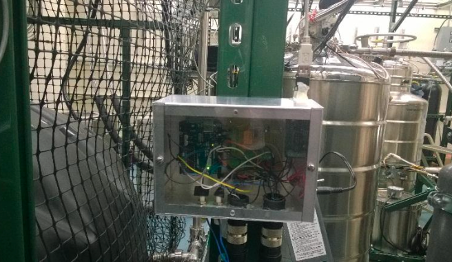

# Arduino Compressor Control System

This project demonstrates an Arduino-based control system designed to operate a Bauer compressor using infrared laser sensors. The system manages compressor actions based on the fill level of a gas bag, which is detected by two infrared lasers.

  
   
  <em>Figure 1: Illustration of the compressor controller in action. Note: additional relay is needed to drive the PLC (see diagram below)</em>

## Overview

The Arduino Compressor Control System automates the operation of a Bauer compressor. It employs infrared lasers to monitor the maximum and minimum thresholds of a gas bag. When both lasers detect blockage, this signifies that the gas bag has reached its maximum capacity, triggering the compressor to activate via a rising edge signal to compress helium into cylinders. Conversely, when neither laser is blocked, it indicates that the bag is at its minimum capacity, prompting the compressor to stop through a falling edge signal.

## Diagram

